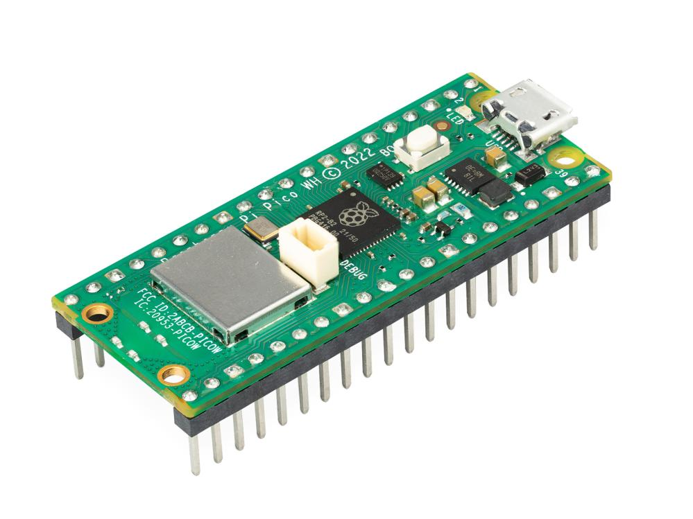
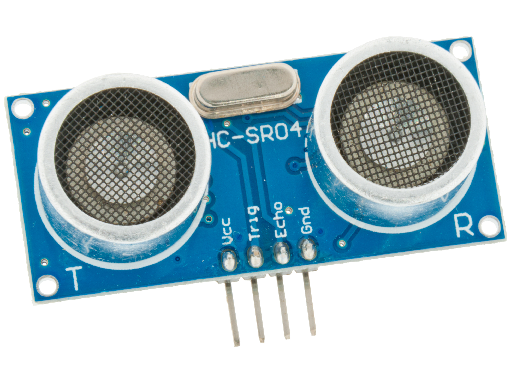
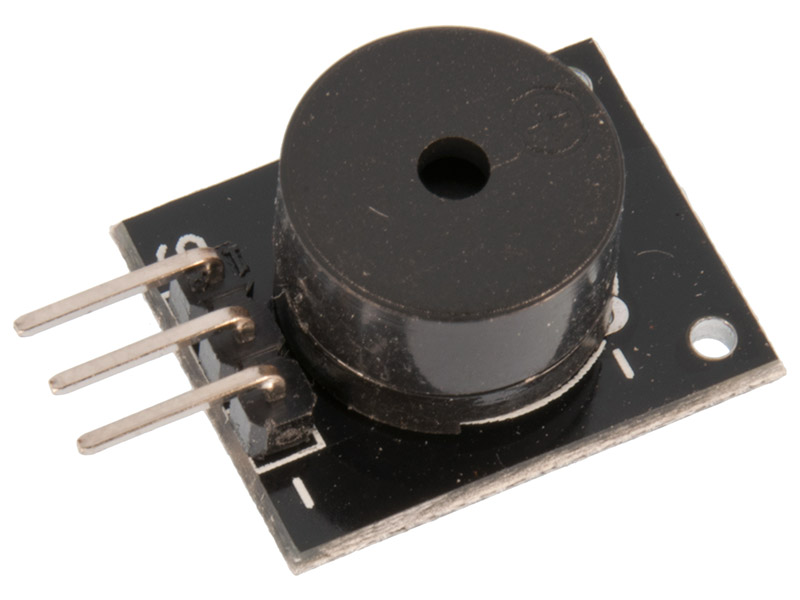
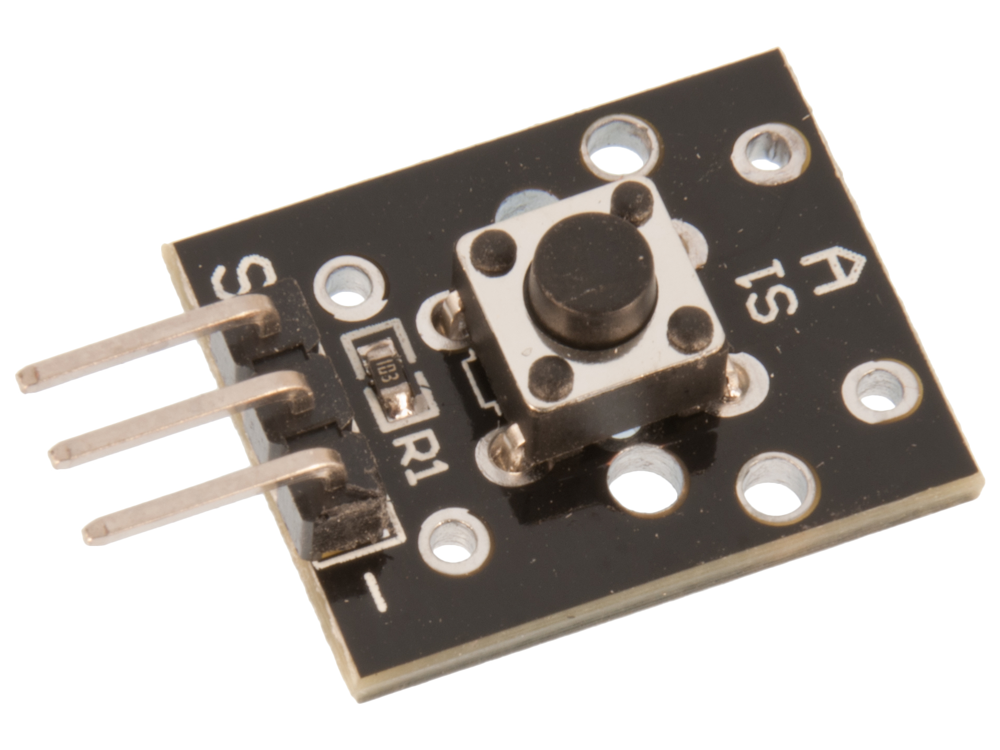
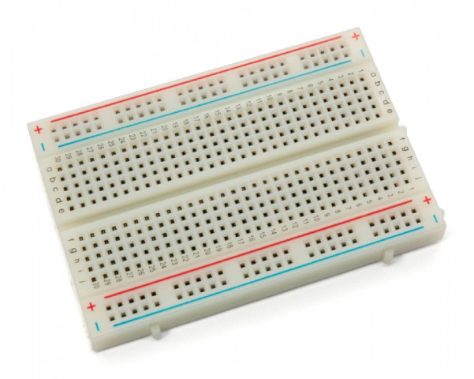
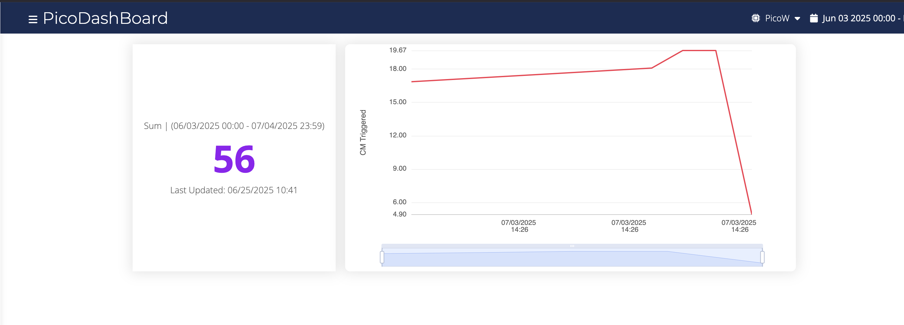
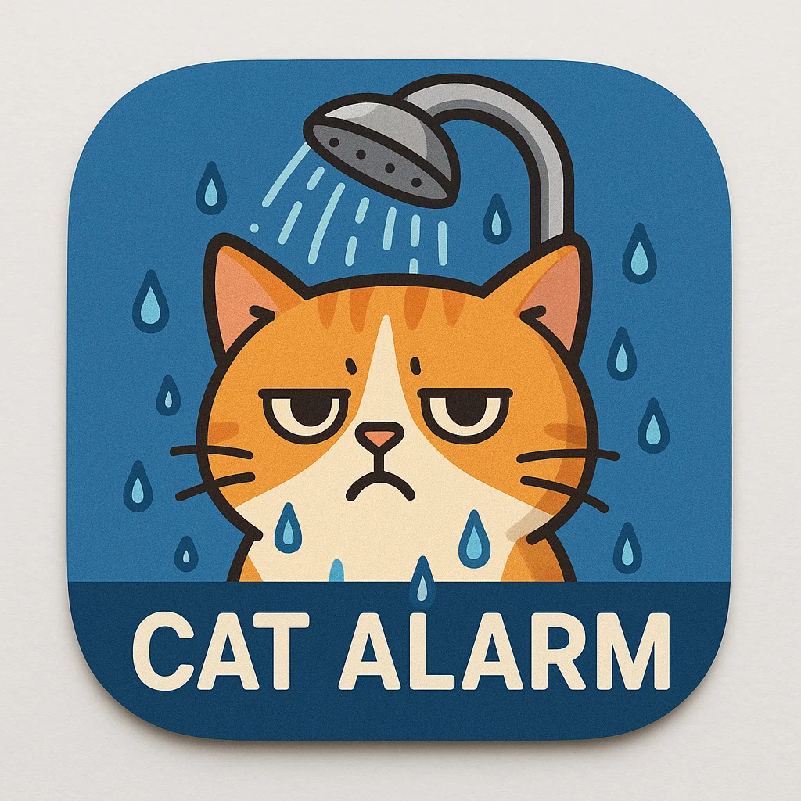
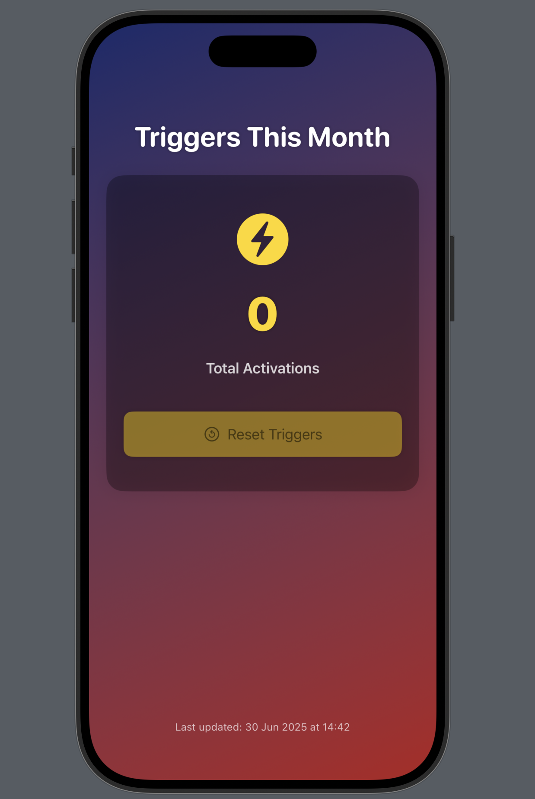

# Cat Alarm IoT Device
* Fabian Moor Pucar (fm222wi)
* Time to build: 5-7 hours


## Project Overview
This project addresses an unwanted feline bathroom behavior through IoT technology. The Cat Alarm is a smart deterrent device that utilizes dual piezo buzzers to create an effective sound barrier, discouraging cats from using inappropriate bathroom locations like showers. The system combines hardware sensors with programmable logic to provide an automated, humane solution for pet behavior modification.

## Objective
This project was conceived after observing our cat "Gubben" consistently using the shower as an alternative bathroom facility. While preferable to furniture, this behavior created unpleasant odors and hygiene concerns. 

**Why I chose this project:**
- Addresses a real-world pet behavior problem
- Combines IoT principles with practical home automation
- Demonstrates sensor integration and automated response systems

**Purpose it serves:**
- Provides humane pet behavior modification
- Automates deterrent response without human intervention
- Creates a reusable solution for similar behavioral issues

**Insights expected:**
- Understanding of sound-based deterrent effectiveness
- Learning IoT sensor integration and response timing
- Exploring automated behavior modification through technology
- Insights into pet behavior. For instance, how many times he thinks I'm not looking at him, and how many times he actually uses the shower as a bathroom.

## Material

All components needed for this project are readily available and affordable. Here's what you'll need:

| Component | Purpose | Specifications | Cost (SEK) |
|-----------|---------|----------------|----------------|
| Raspberry Pi Pico WH | Main microcontroller | WiFi enabled | 99:-  |
| HC-SR04 Ultrasonic Sensor | Distance detection | 3-5V operating voltage | 59:-  |
| Active Piezo Buzzer | Steady tone generation | 3-5V operating voltage | 32:-  |
| Passive Piezo Buzzer | Variable frequency tones | 3-5V operating voltage | 29:-  |
| Push Button | Manual trigger/testing | Momentary switch | 19:-  |
| Breadboard | Circuit assembly | Half-size, 400 tie points | 49:-  |
| Jumper Cables | Connections | Male-Male (8x), Female-Male (7x) | 40:-  |

**Total estimated cost: 320 <-> 340 SEK**

The Raspberry Pi Pico WH serves as the brain of the operation, providing GPIO pins for sensor input and buzzer control, plus WiFi capability for future enhancements. The dual buzzer setup creates a more effective deterrent by combining steady and variable tones.

*[Component photos. Press images for links]*


<a href="https://www.electrokit.com/raspberry-pi-pico-wh">
    
</a>
<a href="https://www.electrokit.com/avstandsmatare-ultraljud-hc-sr04-2-400cm">
    
</a>
<br>
<a href="https://www.electrokit.com/piezohogtalare-aktiv">
    
</a>
<a href="https://www.electrokit.com/piezohogtalare-passiv">
    
</a>
<br>
<a href="https://www.electrokit.com/tryckknapp-momentan">
    
<a href="https://www.electrokit.com/labbsladd-20-pin-15cm-hane/hane">
    
</a>
<br>
<a href="https://www.electrokit.com/labbsladd-20-pin-15cm-hona/hane">
    
</a>
<a href="https://www.electrokit.com/kopplingsdack-400-anslutningar">
    
</a>

## Computer Setup

**Fill out the secrets in config_temp.py and rename it to config.py**

```python
# config.py
SSID = "WIFI NAME"
PASSWORD = "WIFI PASSWORD"
TOKEN = "UBIDOTS TOKEN"
UBIDOTS_BASE_URL = "https://industrial.api.ubidots.com/api/v1.6/devices/"
DEVICE_LABEL = "DEVICE LABEL"
VARIABLE_LABEL = "VARIABLE NAME"
VARIABLE_LABEL_2 = "VARIABLE NAME 2"

LED_PIN = "LED"
PUSH_BUTTON_PIN = 18

TONES = {
    "E5": 659,
    "E6": 1319,
}

TOGGLE_INTERVAL_MS = 50

MAX_WIFI_ATTEMPTS = 20
ULTRASONIC_TIMEOUT_US = 25000
```

**IDE:** NeoVim  
**Microcontroller:** Raspberry Pi Pico WH  
**Programming Language:** MicroPython  

**Libraries used:**
- `machine` - GPIO control and hardware interfaces
- `time` - Timing functions for delays
- `network` - WiFi connection management
- `urequests` - HTTP requests for Ubidots API communication
- `ujson` - JSON handling for data formatting

**Setup steps:**
1. Install MicroPython firmware on Raspberry Pi Pico WH
2. Configure NeoVim with MicroPython support
3. Set up file transfer method (ampy or Thonny)

## Putting Everything Together

### Pin Connections:
* **Ultra Sonic Sensor**
    - VCC → Power Rail (3.3V)
    - GND → GND Rail
    - Trigger (T) → GPIO Pin 20
    - Echo (E) → GPIO Pin 21

* **Active Piezo Buzzer:**
  - Signal (S) → GPIO Pin 27
  - Negative (-) → GND Rail

* **Passive Piezo Buzzer:**
  - Signal (S) → GPIO Pin 26
  - Negative (-) → GND Rail

* **Button:**
  - Positive (+) -> Power Rail (3.3V)
  - Signal (S) → GPIO Pin 18
  - Negative (-) → GND Rail

* **Optional Jumpers:**
  - 3.3V to Power Rail
  - GND to GND Rail

### Assembly:
Follow the pin connections to wire the components on a breadboard.
Either by the Pin Connections above or the Circuit Diagram below.

*[Circuit diagram and connection photo]*

<br>

I did not make use of any resistors, as the components are designed to work with the Pico's GPIO pins directly.
However, if you want to be extra careful, you can add a 1kΩ resistor in series with the button to limit current flow.

### Code Overview

I decided to separate the code into multiple files for better organization. 
The main files are:
- `main.py`: Main program logic with button handling, sensor monitoring, and system control
- `ubidots_client.py`: Ubidots client for data transmission with connection warm-up and retry logic
- `config.py`: Configuration settings including pin assignments, network credentials, and tone frequencies
- `network_manager.py`: Network management functions with WiFi connection handling and bootsel button exit
- `sensors.py`: Sensor handling, featuring the ultrasonic sensor for distance detection with timeout protection
- `actuators.py`: Actuator control, including active/passive buzzers with timer-based tone switching and LED classes

I chose to use classes for the actuators and sensors to encapsulate their functionality 
and make the code more modular. This allows for easier expansion in the future, such 
as adding more sensors or actuators without cluttering the main logic.

The sleep mode functionality has been implemented as a simple loop that waits for button 
press to wake up, rather than using deep sleep mode to avoid USB connection issues during 
development. The system properly shuts down all components when entering sleep mode and 
reactivates them when waking up.

## How It Works

The system operates through a main event loop that monitors button presses and sensor 
readings. When activated, the ultrasonic sensor continuously measures distance every 
50ms. If an object is detected within 20cm, both buzzers activate - the active buzzer 
provides a steady tone while the passive buzzer alternates between E5 (659Hz) and E6 
(1319Hz) frequencies every 50ms using a timer-based approach. Simultaneously, the system 
sends activation data to Ubidots for remote monitoring with a 5-second cooldown to prevent 
API spam. The onboard LED indicates system status, and button handling supports single 
press (toggle sensor) and double press (sleep mode). The sleep mode properly shuts down 
all components and waits for a button press to wake up.


### Code Snippet

Each run we begin by connecting to the WiFi network, if it fails, we exit the program.
This is handled by the network_manager.

```python
# main.py
# Initialize network connection
print("Connecting to WiFi...")
if connect() is None:
    print("ERROR: WiFi connection failed, exiting")
    sys.exit()
```

We then initialize the Ubidots client which is responsible for sending our data to Ubidots.

```python
# Initialize Ubidots client
print("Initializing Ubidots client...")
ubidots_client = UbidotsClient()
```

Initialize the sensors and actuators, which are responsible for reading the distance and
activating the buzzers.

```python
# Initialize hardware components
print("Initializing hardware components...")
ultrasonic_sensor = UltrasonicSensor(trigger_pin=20, echo_pin=21)
active_buzzer = ActiveBuzzer(pin=27)
passive_buzzer = PassiveBuzzer(pin=26)
onboard_led = LED(pin=LED_PIN)
push_button = Pin(PUSH_BUTTON_PIN, Pin.IN, Pin.PULL_UP)
```

### Main Loop
The main loop constantly checks the button state. If pressed once, it toggles the sensor state on or off.
If pressed twice (within a second), it puts the device into sleep mode.
When the sensor is active, it reads the distance every 50ms to be quick to respond.
When the distance is less than 20cm, it activates the buzzers and sends an activation event to Ubidots.
If the sensor is inactive, the buzzers and LED are turned off, and no data is sent to Ubidots.
### Monitoring

For monitoring, I used Ubidots to visualize the data. The system sends activation events 
in the form of a value of 1 to the variable. This allows me to track how many times the 
alarm has been triggered and how often the cat attempts to use the shower.

In order to truly understand how to visualize the data, I added a graph that contains
at which distance the alarm has been triggered. This helps me understand if the cat at 
some point got used to the sound and starts to investigate it more closely. 


<br>

### iOS App
I created a simple iOS app using SwiftUI to visualize the activity from Ubidots. The app
displays the total number of times the alarm has been triggered, providing a quick 
overview of the system's effectiveness. The app is designed to be user-friendly 
and responsive, allowing easy access to the data without needing to log into the 
Ubidots web interface.

I also made it possible to reset the counter from the app. This was a little hacky, as I 
had to make a request where I send the variable the negative value of the current counter.

Because it's just a simple summation of all values sent to the variable.
32 + (-32) = 0. This wasn't that big of an issue as I only intend
to track the number of times the alarm has been triggered. I don't intend to track it 
over time. So resetting it is fine.

The app is built with SwiftUI, making it compatible with iOS devices. It fetches data
via the Ubidots API and displays it in a clean, intuitive interface.

## Screenshot
*[Screenshot of application]*

### Click the app icon to view the app on the Google Play Store.

<!--  -->

<a href="https://pi.fabbemhome.org/track-rickroll">
    
</a>


<br>
